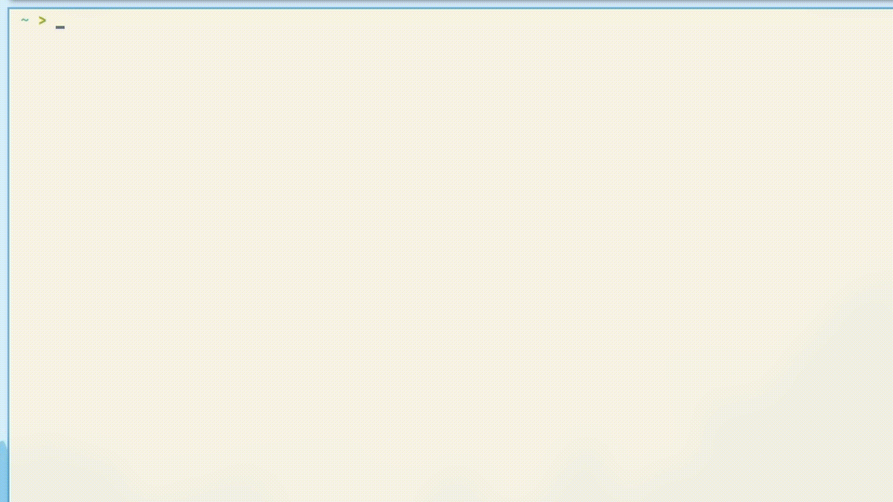
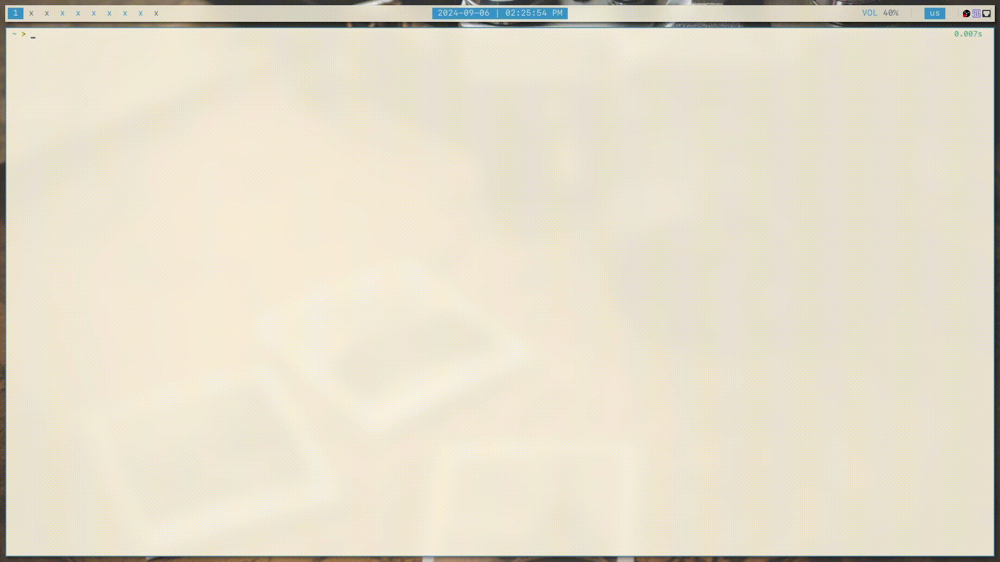
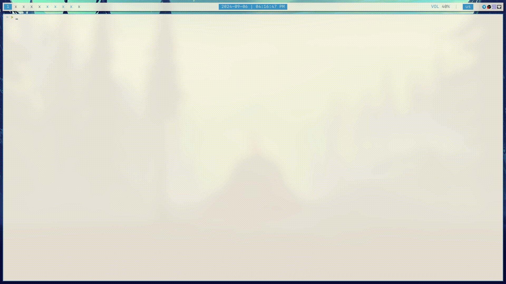
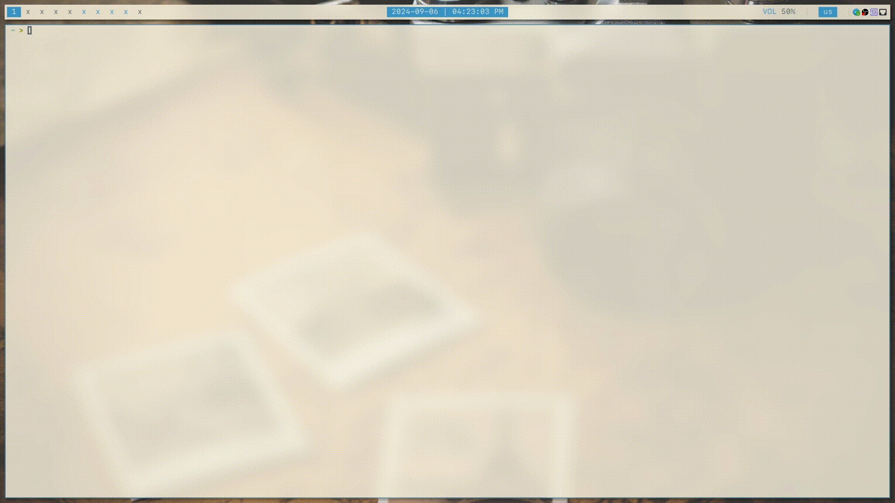

### Random scripts
## mvhlink.sh
This script renames every hard link related to provided one. Usage:
```bash
./mvhlink.sh <where_to_search> <hardlink_path> <new_name>
```

**<where_to_search>** — the path may be actual or relative. For script to work in current directory you can use dot symbol:
```bash
<script> . <hardlink_path> <new_name>
```

**<hardlink_path>** — path to any hardlink which mirrors you need to rename. The path may be actual or relative.

**<new_name>** — a new name for all hardlinks.


## gamepad-battery.sh
This script shows you you gamepad id, name and charge. Usage:
```bash
./<path_to_script>
```

**Dependency**: [upower](https://gitlab.freedesktop.org/upower/upower)

## Neovim workflow
### obsidian/new_file.sh
Creates a file in $HOME/.docs catalog with a date and chosen text as its name, and opens this file with `neovim`.

I use this with my obsidian.nvim workflow. It also has an alias within .zshrc file for 'on'.




## Themes
### theme_change/check_time.sh
Sets light or dark theme with `theme_change/theme_schedule.sh` based on current time. Runs with `fcron`.


### theme_change/theme_changer.sh
Sets current light/dark theme in `theme_change/theme_schedule.sh` to chosen ones. It only has light/dark gruvbox and light everforest and dark nord at the time. It also has an alias within .zshrc file for 'theme'.

To see how it is used, run `theme help`.


### theme_change/theme_schedule.sh
Changes themes for some tools based on what you've set with `theme`. Runs with `theme_change/check_time.sh`, don't need to edit this script manually.




## Miscellanous
### creation_time.sh
Gets the time that this installation exists. Runs with `fastfetch` for the custom output.


### microphone.sh
Un-/mutes default sound source (mic) and sends a notification with `dunst`. Runs with `sxhkd` keybindings.


### neofzf_cont.sh
Searches for files content within $HOME and opens them with `neovim`.


### neofzf_name.sh
Searches for files within $HOME and opens them with `neovim`.




### screenshoter.sh
`scrot` had some issues with rectangular areas selection, so this script does it instead. Runs with `sxhkd` keybindings to make a screenshot of the whole screen, selected window or selected rectangle area, saves new image to $HOME/Pictures and puts it to clipboard. That's it.


### volume.sh
Manages default sound output and sends a notification with `dunst`. Runs with `sxhkd` keybindings.




### vpn.sh
Enables/disables `wireguard` VPN with config in $HOME/.wg. Runs with `sxhkd` keybindings.


### wallpaper_changer.sh
Changes wallpapers to a random image from $HOME/Pictures/wallpapers using `feh`. Runs with `fcron`.


### df.sh
Allows me to use `df` with or without `/mnt` directory based on wether it contains anything. Runs with `dfs` specified in `.zshrc`.
